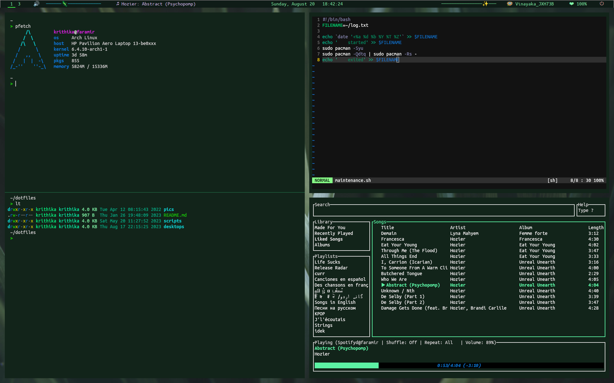

# Dotfiles!

Here are my dotfiles and config for my setups! Hopefully they're useful!

| yee               | haw                                                                |
|-------------------|--------------------------------------------------------------------|
| Distro            | Arch Linux                                                         |
| Shell             | Bash on Linux                                                      |
| WM                | i3-gaps                                                            |
| Bar               | Polybar                                                            |
| Fonts             | Ubuntu Mono Ligaturized, Noto Sans                                 |
| Terminal emulator | kitty                                                              |
| Editor            | Neovim                                                             |

Here's a screenshot!

